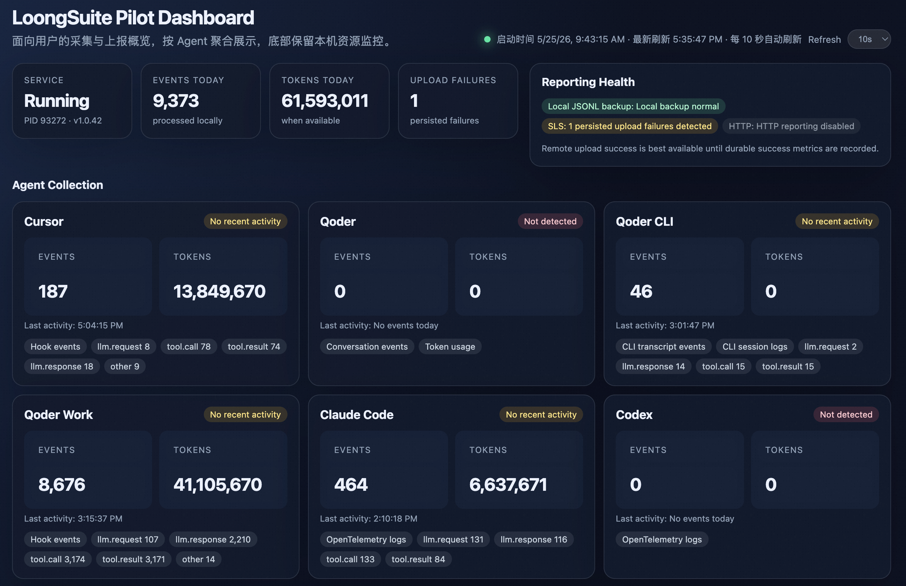
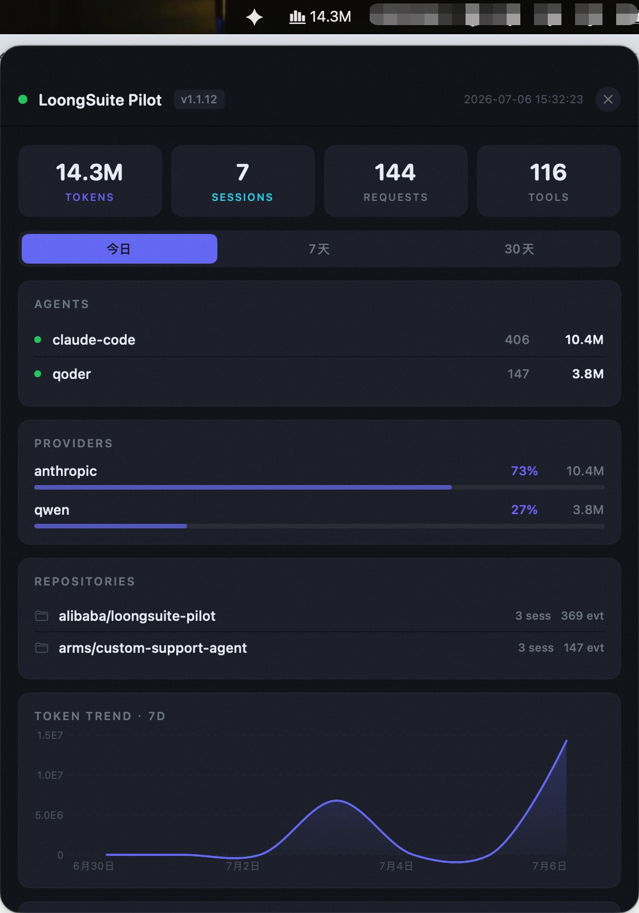

# LoongSuite Pilot

English | [简体中文](README.zh-CN.md)

[Quick Start](#quick-start) | [Documentation](#documentation) | [Agent Onboarding](docs/agent-onboarding.md) | [License](#license)

LoongSuite Pilot is a local telemetry collector for AI coding agents. It discovers supported agents on a developer machine, installs the required hooks or plugins, normalizes activity into a shared GenAI event schema, and exports logs or traces to your chosen backends.

<p align="center">
  
  <br>
  <em>Local dashboard — multi-agent collection status, token usage, and reporting health at a glance.</em>
</p>

## Why LoongSuite Pilot?

Development teams often use more than one AI coding agent, and each agent records activity in a different local format. Pilot gives teams one local collector that can discover those agents, collect their activity, normalize the data, and send it to destinations that are useful for analysis, audit, and observability.

Pilot is designed to answer practical questions:

- Which agents are being used?
- What model, session, turn, and tool activity happened?
- How much token usage is available from each agent?
- Where should the data be exported: local files, SLS, HTTP, or traces?
- How should sensitive prompts, tool arguments, and secrets be controlled before export?

## Core Capabilities


| Capability               | What Pilot Does                                                                    |
| ------------------------ | ---------------------------------------------------------------------------------- |
| Agent discovery          | Detects supported agents from local paths and commands.                            |
| Collection deployment    | Installs hooks or plugins and reads local logs, sessions, or data files.           |
| Unified event schema     | Normalizes agent-native events into a shared GenAI schema.                         |
| Multi-destination output | Exports to JSONL, Alibaba Cloud SLS, HTTP, and OTLP trace backends.                |
| Privacy controls         | Supports per-agent content capture policy and secret masking before output.        |
| Local operations         | Provides service status, restart, rollback, and optional local dashboard commands. |


## Supported Agents


| Agent         | Integration               | Trace Export | Log Export | Token Usage | Conversation / Tool Calls |
| ------------- | ------------------------- | ------------ | ---------- | ----------- | ------------------------- |
| Claude Code   | Hook                      | Yes          | Yes        | Yes         | Yes                       |
| Codex         | Hook                      | Yes          | Yes        | Yes         | Yes                       |
| Cursor        | Hook                      | Yes          | Yes        | Yes         | Yes                       |
| Kiro CLI      | Hook / session polling    | Yes          | Yes        | No          | Yes                       |
| OpenCode      | Plugin injection          | Yes          | Yes        | Yes         | Yes                       |
| Qoder         | Hook                      | Yes          | Yes        | Yes         | Yes                       |
| Qoder CN      | Hook                      | Yes          | Yes        | Yes         | Yes                       |
| Qoder for JetBrains | Detection-only      | Yes          | Yes        | Yes         | Yes                       |
| Qoder CLI     | Hook / session polling    | Yes          | Yes        | Yes         | Yes                       |
| Qoder Work    | Hook / local data polling | Yes          | Yes        | Yes         | Yes                       |
| Qoder Work CN | Hook / local data polling | Yes          | Yes        | Yes         | Yes                       |
| Qwen Code CLI | Hook                      | Yes          | Yes        | Yes         | Yes                       |
| Wukong        | CLI API polling           | Yes          | Yes        | Yes         | Yes                       |


Agent definitions live in `agents.d/`. You can add new agents without changing the deployment framework; see [Agent Onboarding](docs/agent-onboarding.md).

## Quick Start

Prerequisites:

- Node.js 18 or later
- `npm`
- `curl` or `wget`
- PowerShell 5.1 or later on Windows

Install from the public package on Linux or macOS:

```bash
curl -fsSL https://loongcollector-community-edition.oss-cn-shanghai.aliyuncs.com/loongsuite-pilot/installer.sh -o /tmp/loongsuite-pilot-installer.sh && bash /tmp/loongsuite-pilot-installer.sh install
```

Install from the public package on Windows:

```powershell
$installer = "$env:TEMP\loongsuite-pilot-installer.ps1"
Invoke-WebRequest `
  -Uri "https://loongcollector-community-edition.oss-cn-shanghai.aliyuncs.com/loongsuite-pilot/installer.ps1" `
  -OutFile $installer
powershell.exe -NoProfile -ExecutionPolicy Bypass -File $installer install
```

Verify the service:

```bash
loongsuite-pilot status
loongsuite-pilot info
```

Local JSONL output is enabled by default under `~/.loongsuite-pilot/logs/output/` on Linux/macOS and `%USERPROFILE%\.loongsuite-pilot\logs\output\` on Windows.

For installer options, uninstall commands, and source builds, see [Installation](docs/installation.md).

## Configure Pilot

Configuration is loaded in this order: environment variables, then `~/.loongsuite-pilot/config.json`, then built-in defaults.

Start with the guide that matches what you want to change:


| Task                                             | Guide                                            |
| ------------------------------------------------ | ------------------------------------------------ |
| Choose agents and content capture policy         | [Agent Configuration](docs/agents.md)            |
| Write local JSONL logs                           | [Local JSONL Output](docs/local-jsonl-output.md) |
| Report logs to SLS                               | [SLS Output](docs/sls-output.md)                 |
| Report OTLP traces                               | [Trace Output](docs/trace-output.md)             |
| POST events to HTTP                              | [HTTP Output](docs/http-output.md)               |
| Mask secrets before output                       | [Data Masking](docs/masking.md)                  |
| See global config loading and retention settings | [Configuration Guide](docs/configuration.md)     |


## Output Data


| Backend    | Use Case                                                                |
| ---------- | ----------------------------------------------------------------------- |
| JSONL      | Local backup and easy inspection. Enabled by default.                   |
| SLS        | Alibaba Cloud Log Service reporting. Supports WebTracking and AK modes. |
| HTTP       | POST batches to a custom endpoint.                                      |
| OTLP Trace | Export GenAI activity as OpenTelemetry traces.                          |


LoongSuite Pilot emits a normalized GenAI event schema across all supported agents. See [Output Event Schema](docs/output-event-schema.md) for event names, field definitions, provider values, finish reasons, and sensitivity notes for opt-in content fields.

## Operate Pilot

Use the `loongsuite-pilot` command after installation:

```bash
loongsuite-pilot start
loongsuite-pilot stop
loongsuite-pilot restart
loongsuite-pilot status
loongsuite-pilot info
loongsuite-pilot token-usage
loongsuite-pilot rollback
```

Optional local dashboard:

```bash
loongsuite-pilot monitor start
```

Then open `http://127.0.0.1:8765/`.

macOS menu bar app:

On macOS, Pilot automatically runs a menu bar app after installation — no extra command needed. It shows live token, session, request, and tool counts, plus per-agent and per-provider breakdowns, so you can keep an eye on activity without opening the dashboard.

<p align="center">
  
</p>

To disable it, set `LOONGSUITE_PILOT_ENABLE_STATUS_BAR_APP=false` or add `"enableStatusBarApp": false` to `~/.loongsuite-pilot/config.json`.

## Documentation

[User Manual](docs/README.md) - Complete guide to installing, configuring, operating, and extending Pilot

[Installation Guide](docs/installation.md) - Install from package, verify service, uninstall, and run from source

[Configuration Reference](docs/configuration.md) - Global config loading, runtime switches, retention, and links to output and privacy setup

[Output Schema](docs/output-event-schema.md) - Normalized event names, fields, provider values, and finish reasons

[Developer Guide](docs/agent-onboarding.md) - Add support for a new AI coding agentBuild From Source

```bash
git clone https://github.com/loongsuite/loongsuite-pilot.git
cd loongsuite-pilot
npm install
npm run build
node scripts/postinstall.js
node dist/index.js
```

For local development:

```bash
npm install
npm run build
npm run typecheck
npm test
```

For packaging and service installation from a local build, see [Installation](docs/installation.md).

## Community

We are looking forward to your feedback and suggestions. Scan the QR code below to join the LoongSuite Pilot DingTalk group.

| LoongSuite Pilot SIG |
|----|
|  |

### Related Projects

- [LoongCollector](https://github.com/alibaba/loongcollector) - Universal node agent for log, metric and eBPF-based collection
- [LoongSuite JS](https://github.com/alibaba/loongsuite-js) - OpenTelemetry instrumentation plugins for JS-based AI coding agents
- [LoongSuite Python](https://github.com/alibaba/loongsuite-python) - Process agent for Python applications
- [LoongSuite Go](https://github.com/alibaba/loongsuite-go) - Process agent for Golang with compile-time instrumentation
- [LoongSuite Java](https://github.com/alibaba/loongsuite-java) - GenAI telemetry utility library for Java applications

## License

Apache License 2.0 - see [LICENSE](LICENSE) for details.
